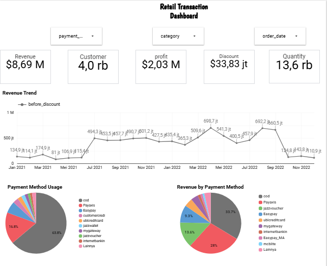
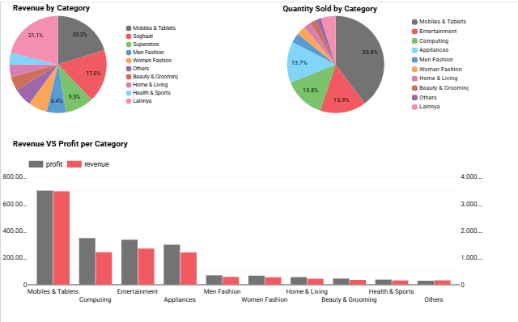
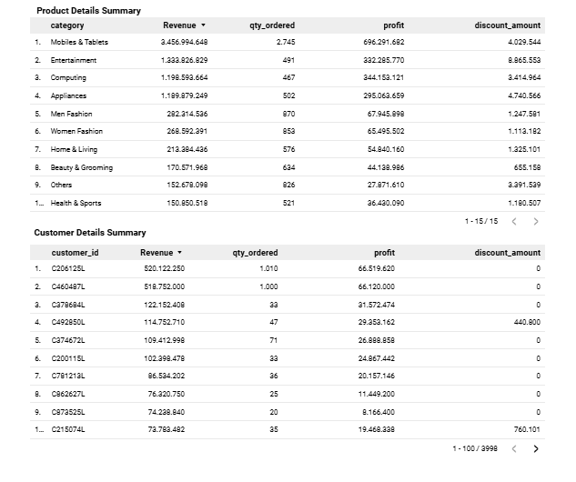

# 📊 Retail Transaction Dashboard | Looker Studio

## 📌 Project Overview
This project presents an interactive Retail Transaction Dashboard built using Google Looker Studio to analyze business performance, customer purchasing behavior, product category performance, and payment method trends.

The dashboard transforms raw transaction data into actionable insights through interactive visualizations and dynamic filters, enabling users to monitor key business metrics and support data-driven decision-making.

---

## 🎯 Project Objectives

- Monitor overall business performance through key metrics and trends.
- Analyze revenue, profit, and customer growth over time.
- Identify top-performing product categories and payment methods.
- Understand customer purchasing behavior and revenue contribution.
- Provide interactive insights to support business decision-making.

---

## 📈 Key Performance Indicators (KPIs)

- Revenue: **$8.69 Million**
- Profit: **$2.03 Million**
- Total Customers: **4.0K**
- Total Quantity Sold: **13.6K**
- Total Discount: **$33.83 Million**

---

## 📊 Dashboard Features

### Revenue Trend Analysis
- Monthly revenue trend analysis.
- Identify seasonal sales patterns and peak sales periods.

### Payment Method Analysis
- Revenue contribution by payment method.
- Payment method usage distribution.

### Product Category Analysis
- Revenue by category.
- Quantity sold by category.
- Revenue vs Profit comparison across product categories.

### Customer Analysis
- Top customers by revenue contribution.
- Customer purchasing behavior and profitability.

### Product Performance Analysis
- Category-level performance evaluation.
- Profitability analysis across products.

---

## 🔍 Interactive Filters

The dashboard includes interactive filters that allow users to analyze the data dynamically by:

- Payment Method
- Product Category
- Order Date

All KPI cards and visualizations automatically update based on the selected filters, providing a flexible and interactive analytical experience.

---

## 📌 Key Business Insights

- Revenue reached **$8.69M**, generating a total profit of **$2.03M**.
- The **Mobiles & Tablets** category contributed the highest revenue and quantity sold.
- Revenue is highly concentrated in several major product categories.
- Certain payment methods dominate transaction volume and revenue contribution.
- A small number of customers contribute significantly to total revenue, indicating the presence of high-value customers.

---

## 💡 Business Recommendations

### Optimize High-Performing Categories
Increase inventory availability and marketing investment for top-performing categories, particularly **Mobiles & Tablets**.

### Strengthen Customer Retention
Develop loyalty programs and personalized promotions targeting high-value customers.

### Improve Payment Experience
Focus on the most frequently used payment methods and optimize the checkout experience to improve customer satisfaction.

### Increase Cross-Selling Opportunities
Bundle complementary products and recommend related items to increase average transaction value.

### Evaluate Discount Strategies
Analyze the effectiveness of discount programs to ensure they contribute positively to profitability.

---

## 🛠️ Tools & Technologies

- Google Looker Studio
- Google Sheets / CSV
- Data Cleaning & Transformation
- Interactive Dashboard Design

---

## 📊 Skills Demonstrated

- Data Cleaning
- Exploratory Data Analysis (EDA)
- Business Intelligence
- Dashboard Design
- Data Visualization
- KPI Development
- Business Insight Generation
- Interactive Reporting

---

## 📷 Dashboard Preview

---

## 📌 Conclusion

This dashboard demonstrates the ability to transform raw retail transaction data into interactive business insights through data visualization and KPI analysis. The project highlights skills in business intelligence, dashboard development, and data-driven decision-making using Google Looker Studio.

## 🔗 Live Dashboard
[View Dashboard](https://datastudio.google.com/reporting/f0afdc21-81bf-4d7c-8177-14fb715380f1)

⭐ This project showcases end-to-end data analysis and interactive dashboard development, enabling stakeholders to monitor business performance and identify opportunities for growth.
